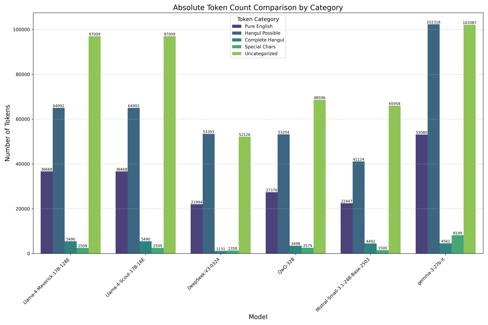
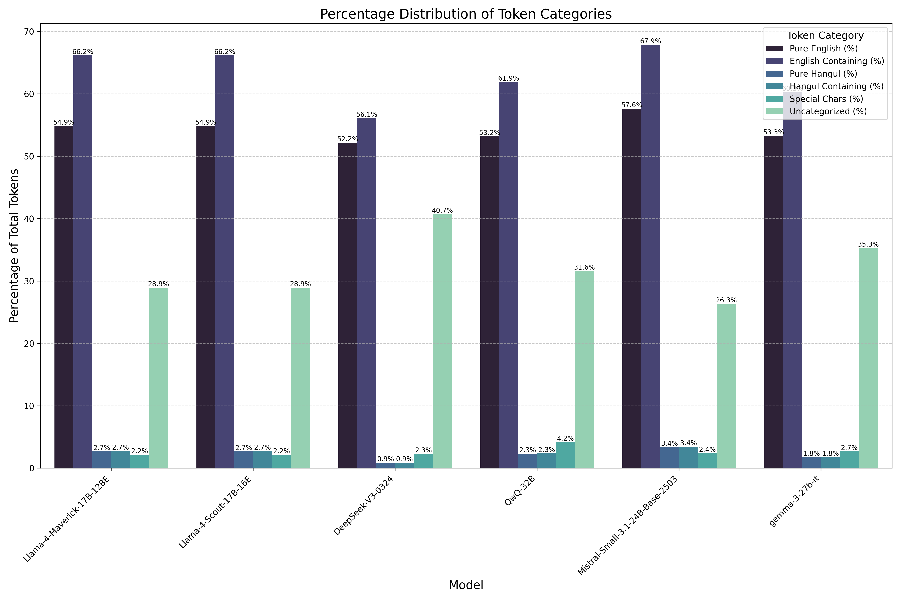
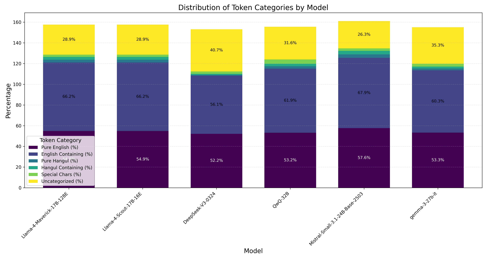
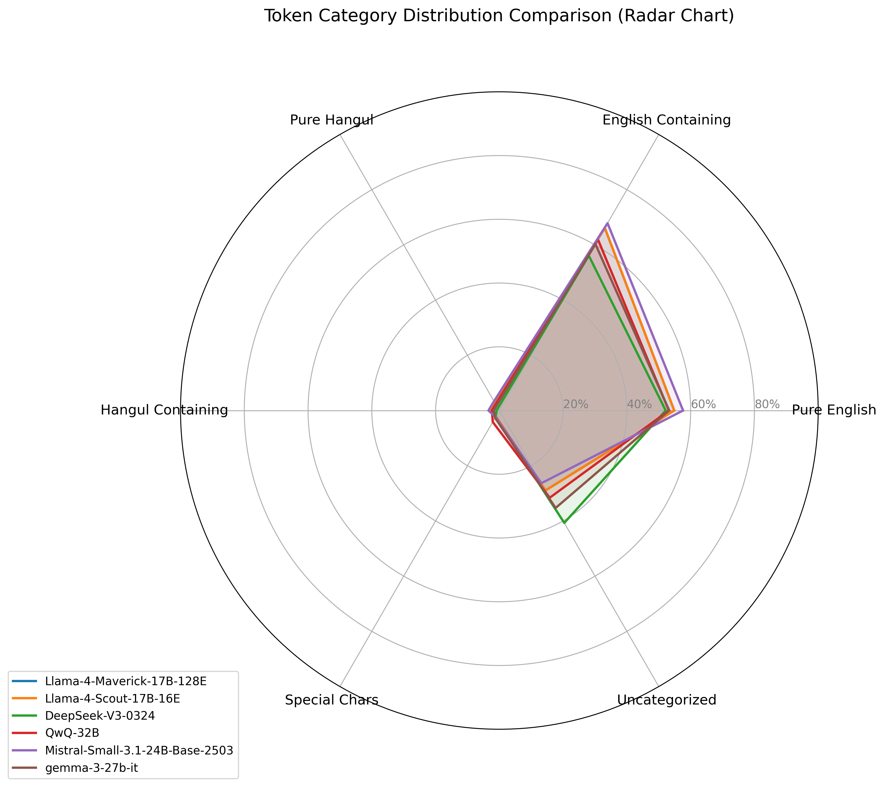

# Korean Tokenizers Comparison

This repository contains a comprehensive analysis of various tokenizers and their performance on Korean text. Below you'll find a summary of the analysis and visual results.

## Run
to get statistics of tokens
```
python3 run_analyzer.py --models {model list separater by space}
```
to generate examples
```
python3 generate_example.py --models {model list separater by space} --sentences {sentnece list separater by |}
```
## Analysis Summary

<table id="T_abd32">
  <caption>Detailed Tokenizer Analysis Comparison</caption>
  <thead>
    <tr>
      <th class="blank level0" >&nbsp;</th>
      <th id="T_abd32_level0_col0" class="col_heading level0 col0" >Model</th>
      <th id="T_abd32_level0_col1" class="col_heading level0 col1" >Total Tokens</th>
      <th id="T_abd32_level0_col2" class="col_heading level0 col2" >Pure English</th>
      <th id="T_abd32_level0_col3" class="col_heading level0 col3" >Pure English (%)</th>
      <th id="T_abd32_level0_col4" class="col_heading level0 col4" >English Containing</th>
      <th id="T_abd32_level0_col5" class="col_heading level0 col5" >English Containing (%)</th>
      <th id="T_abd32_level0_col6" class="col_heading level0 col6" >Pure Hangul</th>
      <th id="T_abd32_level0_col7" class="col_heading level0 col7" >Pure Hangul (%)</th>
      <th id="T_abd32_level0_col8" class="col_heading level0 col8" >Hangul Containing</th>
      <th id="T_abd32_level0_col9" class="col_heading level0 col9" >Hangul Containing (%)</th>
      <th id="T_abd32_level0_col10" class="col_heading level0 col10" >Special Chars</th>
      <th id="T_abd32_level0_col11" class="col_heading level0 col11" >Special Chars (%)</th>
      <th id="T_abd32_level0_col12" class="col_heading level0 col12" >Uncategorized</th>
      <th id="T_abd32_level0_col13" class="col_heading level0 col13" >Uncategorized (%)</th>
    </tr>
  </thead>
  <tbody>
    <tr>
      <th id="T_abd32_level0_row0" class="row_heading level0 row0" >0</th>
      <td id="T_abd32_row0_col0" class="data row0 col0" >Llama-4-Maverick-17B-128E</td>
      <td id="T_abd32_row0_col1" class="data row0 col1" >201032</td>
      <td id="T_abd32_row0_col2" class="data row0 col2" >110293</td>
      <td id="T_abd32_row0_col3" class="data row0 col3" >54.86%</td>
      <td id="T_abd32_row0_col4" class="data row0 col4" >132986</td>
      <td id="T_abd32_row0_col5" class="data row0 col5" >66.15%</td>
      <td id="T_abd32_row0_col6" class="data row0 col6" >5415</td>
      <td id="T_abd32_row0_col7" class="data row0 col7" >2.69%</td>
      <td id="T_abd32_row0_col8" class="data row0 col8" >5490</td>
      <td id="T_abd32_row0_col9" class="data row0 col9" >2.73%</td>
      <td id="T_abd32_row0_col10" class="data row0 col10" >4353</td>
      <td id="T_abd32_row0_col11" class="data row0 col11" >2.17%</td>
      <td id="T_abd32_row0_col12" class="data row0 col12" >58203</td>
      <td id="T_abd32_row0_col13" class="data row0 col13" >28.95%</td>
    </tr>
    <tr>
      <th id="T_abd32_level0_row1" class="row_heading level0 row1" >1</th>
      <td id="T_abd32_row1_col0" class="data row1 col0" >Llama-4-Scout-17B-16E</td>
      <td id="T_abd32_row1_col1" class="data row1 col1" >201032</td>
      <td id="T_abd32_row1_col2" class="data row1 col2" >110293</td>
      <td id="T_abd32_row1_col3" class="data row1 col3" >54.86%</td>
      <td id="T_abd32_row1_col4" class="data row1 col4" >132986</td>
      <td id="T_abd32_row1_col5" class="data row1 col5" >66.15%</td>
      <td id="T_abd32_row1_col6" class="data row1 col6" >5415</td>
      <td id="T_abd32_row1_col7" class="data row1 col7" >2.69%</td>
      <td id="T_abd32_row1_col8" class="data row1 col8" >5490</td>
      <td id="T_abd32_row1_col9" class="data row1 col9" >2.73%</td>
      <td id="T_abd32_row1_col10" class="data row1 col10" >4353</td>
      <td id="T_abd32_row1_col11" class="data row1 col11" >2.17%</td>
      <td id="T_abd32_row1_col12" class="data row1 col12" >58203</td>
      <td id="T_abd32_row1_col13" class="data row1 col13" >28.95%</td>
    </tr>
    <tr>
      <th id="T_abd32_level0_row2" class="row_heading level0 row2" >2</th>
      <td id="T_abd32_row2_col0" class="data row2 col0" >DeepSeek-V3-0324</td>
      <td id="T_abd32_row2_col1" class="data row2 col1" >128712</td>
      <td id="T_abd32_row2_col2" class="data row2 col2" >67156</td>
      <td id="T_abd32_row2_col3" class="data row2 col3" >52.18%</td>
      <td id="T_abd32_row2_col4" class="data row2 col4" >72217</td>
      <td id="T_abd32_row2_col5" class="data row2 col5" >56.11%</td>
      <td id="T_abd32_row2_col6" class="data row2 col6" >1120</td>
      <td id="T_abd32_row2_col7" class="data row2 col7" >0.87%</td>
      <td id="T_abd32_row2_col8" class="data row2 col8" >1131</td>
      <td id="T_abd32_row2_col9" class="data row2 col9" >0.88%</td>
      <td id="T_abd32_row2_col10" class="data row2 col10" >2953</td>
      <td id="T_abd32_row2_col11" class="data row2 col11" >2.29%</td>
      <td id="T_abd32_row2_col12" class="data row2 col12" >52411</td>
      <td id="T_abd32_row2_col13" class="data row2 col13" >40.72%</td>
    </tr>
    <tr>
      <th id="T_abd32_level0_row3" class="row_heading level0 row3" >3</th>
      <td id="T_abd32_row3_col0" class="data row3 col0" >QwQ-32B</td>
      <td id="T_abd32_row3_col1" class="data row3 col1" >151566</td>
      <td id="T_abd32_row3_col2" class="data row3 col2" >80586</td>
      <td id="T_abd32_row3_col3" class="data row3 col3" >53.17%</td>
      <td id="T_abd32_row3_col4" class="data row3 col4" >93836</td>
      <td id="T_abd32_row3_col5" class="data row3 col5" >61.91%</td>
      <td id="T_abd32_row3_col6" class="data row3 col6" >3525</td>
      <td id="T_abd32_row3_col7" class="data row3 col7" >2.33%</td>
      <td id="T_abd32_row3_col8" class="data row3 col8" >3547</td>
      <td id="T_abd32_row3_col9" class="data row3 col9" >2.34%</td>
      <td id="T_abd32_row3_col10" class="data row3 col10" >6287</td>
      <td id="T_abd32_row3_col11" class="data row3 col11" >4.15%</td>
      <td id="T_abd32_row3_col12" class="data row3 col12" >47896</td>
      <td id="T_abd32_row3_col13" class="data row3 col13" >31.60%</td>
    </tr>
    <tr>
      <th id="T_abd32_level0_row4" class="row_heading level0 row4" >4</th>
      <td id="T_abd32_row4_col0" class="data row4 col0" >Mistral-Small-3.1-24B-Base-2503</td>
      <td id="T_abd32_row4_col1" class="data row4 col1" >130969</td>
      <td id="T_abd32_row4_col2" class="data row4 col2" >75461</td>
      <td id="T_abd32_row4_col3" class="data row4 col3" >57.62%</td>
      <td id="T_abd32_row4_col4" class="data row4 col4" >88883</td>
      <td id="T_abd32_row4_col5" class="data row4 col5" >67.87%</td>
      <td id="T_abd32_row4_col6" class="data row4 col6" >4405</td>
      <td id="T_abd32_row4_col7" class="data row4 col7" >3.36%</td>
      <td id="T_abd32_row4_col8" class="data row4 col8" >4492</td>
      <td id="T_abd32_row4_col9" class="data row4 col9" >3.43%</td>
      <td id="T_abd32_row4_col10" class="data row4 col10" >3098</td>
      <td id="T_abd32_row4_col11" class="data row4 col11" >2.37%</td>
      <td id="T_abd32_row4_col12" class="data row4 col12" >34496</td>
      <td id="T_abd32_row4_col13" class="data row4 col13" >26.34%</td>
    </tr>
    <tr>
      <th id="T_abd32_level0_row5" class="row_heading level0 row5" >5</th>
      <td id="T_abd32_row5_col0" class="data row5 col0" >gemma-3-27b-it</td>
      <td id="T_abd32_row5_col1" class="data row5 col1" >262042</td>
      <td id="T_abd32_row5_col2" class="data row5 col2" >139585</td>
      <td id="T_abd32_row5_col3" class="data row5 col3" >53.27%</td>
      <td id="T_abd32_row5_col4" class="data row5 col4" >157959</td>
      <td id="T_abd32_row5_col5" class="data row5 col5" >60.28%</td>
      <td id="T_abd32_row5_col6" class="data row5 col6" >4613</td>
      <td id="T_abd32_row5_col7" class="data row5 col7" >1.76%</td>
      <td id="T_abd32_row5_col8" class="data row5 col8" >4613</td>
      <td id="T_abd32_row5_col9" class="data row5 col9" >1.76%</td>
      <td id="T_abd32_row5_col10" class="data row5 col10" >6975</td>
      <td id="T_abd32_row5_col11" class="data row5 col11" >2.66%</td>
      <td id="T_abd32_row5_col12" class="data row5 col12" >92495</td>
      <td id="T_abd32_row5_col13" class="data row5 col13" >35.30%</td>
    </tr>
  </tbody>
</table>


## Visualization Results

### Token Count Comparison

*Comparison of absolute token counts across different tokenizers for Korean text samples.*

### Token Distribution

*Percentage distribution of different token types across tokenizers.*

### Stacked Distribution

*Stacked view of token type distribution percentages across tokenizers.*

### Radar Chart

*Radar chart showing the relative strengths of each tokenizer across different metrics.*

## Sentence examples
<table border="1" class="dataframe">
  <thead>
    <tr style="text-align: right;">
      <th>Position</th>
      <th>Llama-4-Maverick-17B-128E_Token</th>
      <th>Llama-4-Maverick-17B-128E_ID</th>
      <th>Llama-4-Scout-17B-16E_Token</th>
      <th>Llama-4-Scout-17B-16E_ID</th>
      <th>DeepSeek-V3-0324_Token</th>
      <th>DeepSeek-V3-0324_ID</th>
      <th>QwQ-32B_Token</th>
      <th>QwQ-32B_ID</th>
      <th>Mistral-Small-3.1-24B-Base-2503_Token</th>
      <th>Mistral-Small-3.1-24B-Base-2503_ID</th>
      <th>gemma-3-27b-it_Token</th>
      <th>gemma-3-27b-it_ID</th>
    </tr>
  </thead>
  <tbody>
    <tr>
      <td>1</td>
      <td>This</td>
      <td>3231</td>
      <td>This</td>
      <td>3231</td>
      <td>This</td>
      <td>2337</td>
      <td>This</td>
      <td>1986</td>
      <td>This</td>
      <td>4380</td>
      <td>This</td>
      <td>2094</td>
    </tr>
    <tr>
      <td>2</td>
      <td>Ġis</td>
      <td>3231</td>
      <td>Ġis</td>
      <td>3231</td>
      <td>Ġis</td>
      <td>2337</td>
      <td>Ġis</td>
      <td>374</td>
      <td>Ġis</td>
      <td>4380</td>
      <td>▁is</td>
      <td>2094</td>
    </tr>
    <tr>
      <td>3</td>
      <td>Ġa</td>
      <td>373</td>
      <td>Ġa</td>
      <td>373</td>
      <td>Ġa</td>
      <td>344</td>
      <td>Ġa</td>
      <td>264</td>
      <td>Ġa</td>
      <td>1395</td>
      <td>▁a</td>
      <td>563</td>
    </tr>
    <tr>
      <td>4</td>
      <td>Ġtest</td>
      <td>262</td>
      <td>Ġtest</td>
      <td>262</td>
      <td>Ġtest</td>
      <td>260</td>
      <td>Ġtest</td>
      <td>1273</td>
      <td>Ġtest</td>
      <td>1261</td>
      <td>▁test</td>
      <td>496</td>
    </tr>
    <tr>
      <td>5</td>
      <td>ĠEnglish</td>
      <td>1600</td>
      <td>ĠEnglish</td>
      <td>1600</td>
      <td>ĠEnglish</td>
      <td>1950</td>
      <td>ĠEnglish</td>
      <td>6364</td>
      <td>ĠEnglish</td>
      <td>2688</td>
      <td>▁English</td>
      <td>1594</td>
    </tr>
    <tr>
      <td>6</td>
      <td>Ġsentence</td>
      <td>10404</td>
      <td>Ġsentence</td>
      <td>10404</td>
      <td>Ġsentence</td>
      <td>3947</td>
      <td>Ġsentence</td>
      <td>11652</td>
      <td>Ġsentence</td>
      <td>7846</td>
      <td>▁sentence</td>
      <td>5422</td>
    </tr>
    <tr>
      <td>7</td>
      <td>.</td>
      <td>17705</td>
      <td>.</td>
      <td>17705</td>
      <td>.</td>
      <td>10175</td>
      <td></td>
      <td></td>
      <td>.</td>
      <td>19286</td>
      <td>.</td>
      <td>13315</td>
    </tr>
  </tbody>
</table>
   
<table border="1" class="dataframe">
  <thead>
    <tr style="text-align: right;">
      <th>Position</th>
      <th>Llama-4-Maverick-17B-128E_Token</th>
      <th>Llama-4-Maverick-17B-128E_ID</th>
      <th>Llama-4-Scout-17B-16E_Token</th>
      <th>Llama-4-Scout-17B-16E_ID</th>
      <th>DeepSeek-V3-0324_Token</th>
      <th>DeepSeek-V3-0324_ID</th>
      <th>QwQ-32B_Token</th>
      <th>QwQ-32B_ID</th>
      <th>Mistral-Small-3.1-24B-Base-2503_Token</th>
      <th>Mistral-Small-3.1-24B-Base-2503_ID</th>
      <th>gemma-3-27b-it_Token</th>
      <th>gemma-3-27b-it_ID</th>
    </tr>
  </thead>
  <tbody>
    <tr>
      <td>1</td>
      <td>&lt;|begin_of_text|&gt;</td>
      <td>200000</td>
      <td>&lt;|begin_of_text|&gt;</td>
      <td>200000</td>
      <td>&lt;｜begin▁of▁sentence｜&gt;</td>
      <td>0</td>
      <td>다</td>
      <td>13146</td>
      <td>&lt;s&gt;</td>
      <td>1</td>
      <td>&lt;bos&gt;</td>
      <td>2</td>
    </tr>
    <tr>
      <td>2</td>
      <td>다</td>
      <td>1162</td>
      <td>다</td>
      <td>1162</td>
      <td>다</td>
      <td>3874</td>
      <td>양</td>
      <td>126345</td>
      <td>다</td>
      <td>1739</td>
      <td>다</td>
      <td>237131</td>
    </tr>
    <tr>
      <td>3</td>
      <td>양</td>
      <td>10461</td>
      <td>양</td>
      <td>10461</td>
      <td>양</td>
      <td>31123</td>
      <td>한</td>
      <td>23573</td>
      <td>양</td>
      <td>14977</td>
      <td>양</td>
      <td>238884</td>
    </tr>
    <tr>
      <td>4</td>
      <td>한</td>
      <td>1842</td>
      <td>한</td>
      <td>1842</td>
      <td>한</td>
      <td>5634</td>
      <td>토</td>
      <td>10764</td>
      <td>한</td>
      <td>2316</td>
      <td>한</td>
      <td>237384</td>
    </tr>
    <tr>
      <td>5</td>
      <td>토</td>
      <td>30209</td>
      <td>토</td>
      <td>30209</td>
      <td>토</td>
      <td>74905</td>
      <td>토</td>
      <td>228</td>
      <td>토</td>
      <td>28799</td>
      <td>토</td>
      <td>68274</td>
    </tr>
    <tr>
      <td>6</td>
      <td>크</td>
      <td>10987</td>
      <td>크</td>
      <td>10987</td>
      <td>크</td>
      <td>34899</td>
      <td>토크</td>
      <td>57160</td>
      <td>크</td>
      <td>14498</td>
      <td>크</td>
      <td>238572</td>
    </tr>
    <tr>
      <td>7</td>
      <td>나</td>
      <td>4809</td>
      <td>나</td>
      <td>4809</td>
      <td>나</td>
      <td>12671</td>
      <td>크</td>
      <td>223</td>
      <td>나</td>
      <td>3594</td>
      <td>나</td>
      <td>237610</td>
    </tr>
    <tr>
      <td>8</td>
      <td>이저</td>
      <td>119553</td>
      <td>이저</td>
      <td>119553</td>
      <td>이</td>
      <td>3761</td>
      <td>크</td>
      <td>105</td>
      <td>이</td>
      <td>1856</td>
      <td>이</td>
      <td>237077</td>
    </tr>
    <tr>
      <td>9</td>
      <td>가</td>
      <td>2166</td>
      <td>가</td>
      <td>2166</td>
      <td>저</td>
      <td>46520</td>
      <td>나</td>
      <td>60315</td>
      <td>저</td>
      <td>12375</td>
      <td>저</td>
      <td>238650</td>
    </tr>
    <tr>
      <td>10</td>
      <td>어떻게</td>
      <td>57215</td>
      <td>어떻게</td>
      <td>57215</td>
      <td>가</td>
      <td>6751</td>
      <td>이</td>
      <td>12802</td>
      <td>가</td>
      <td>2385</td>
      <td>가</td>
      <td>237272</td>
    </tr>
    <tr>
      <td>11</td>
      <td>처리</td>
      <td>53982</td>
      <td>처리</td>
      <td>53982</td>
      <td>어떻게</td>
      <td>107730</td>
      <td>저</td>
      <td>126781</td>
      <td>어떻게</td>
      <td>24268</td>
      <td>어떻게</td>
      <td>61318</td>
    </tr>
    <tr>
      <td>12</td>
      <td>하는</td>
      <td>5261</td>
      <td>하는</td>
      <td>5261</td>
      <td>처리</td>
      <td>114952</td>
      <td>가</td>
      <td>19969</td>
      <td>처리</td>
      <td>66572</td>
      <td>처리</td>
      <td>94478</td>
    </tr>
    <tr>
      <td>13</td>
      <td>지</td>
      <td>1979</td>
      <td>지</td>
      <td>1979</td>
      <td>하는</td>
      <td>14007</td>
      <td>어떻게</td>
      <td>130108</td>
      <td>하는</td>
      <td>5447</td>
      <td>하는</td>
      <td>11973</td>
    </tr>
    <tr>
      <td>14</td>
      <td>보고</td>
      <td>46830</td>
      <td>보고</td>
      <td>46830</td>
      <td>지</td>
      <td>6676</td>
      <td>처리</td>
      <td>81058</td>
      <td>지</td>
      <td>2369</td>
      <td>지</td>
      <td>237308</td>
    </tr>
    <tr>
      <td>15</td>
      <td>싶</td>
      <td>50316</td>
      <td>싶</td>
      <td>50316</td>
      <td>보고</td>
      <td>112003</td>
      <td>하는</td>
      <td>42905</td>
      <td>보고</td>
      <td>24564</td>
      <td>보고</td>
      <td>65819</td>
    </tr>
    <tr>
      <td>16</td>
      <td>습니다</td>
      <td>5700</td>
      <td>습니다</td>
      <td>5700</td>
      <td>싶</td>
      <td>124431</td>
      <td>지</td>
      <td>21329</td>
      <td>싶</td>
      <td>18288</td>
      <td>싶</td>
      <td>59475</td>
    </tr>
    <tr>
      <td>17</td>
      <td>.</td>
      <td>26</td>
      <td>.</td>
      <td>26</td>
      <td>습니다</td>
      <td>19418</td>
      <td>보</td>
      <td>63332</td>
      <td>습니다</td>
      <td>10883</td>
      <td>습니다</td>
      <td>10131</td>
    </tr>
    <tr>
      <td>18</td>
      <td></td>
      <td></td>
      <td></td>
      <td></td>
      <td>.</td>
      <td>16</td>
      <td>고</td>
      <td>34395</td>
      <td>.</td>
      <td>1046</td>
      <td>.</td>
      <td>236761</td>
    </tr>
    <tr>
      <td>19</td>
      <td></td>
      <td></td>
      <td></td>
      <td></td>
      <td></td>
      <td></td>
      <td>싶</td>
      <td>28927</td>
      <td></td>
      <td></td>
      <td></td>
      <td></td>
    </tr>
    <tr>
      <td>20</td>
      <td></td>
      <td></td>
      <td></td>
      <td></td>
      <td></td>
      <td></td>
      <td>싶</td>
      <td>114</td>
      <td></td>
      <td></td>
      <td></td>
      <td></td>
    </tr>
    <tr>
      <td>21</td>
      <td></td>
      <td></td>
      <td></td>
      <td></td>
      <td></td>
      <td></td>
      <td>습니다</td>
      <td>38231</td>
      <td></td>
      <td></td>
      <td></td>
      <td></td>
    </tr>
    <tr>
      <td>22</td>
      <td></td>
      <td></td>
      <td></td>
      <td></td>
      <td></td>
      <td></td>
      <td>.</td>
      <td>13</td>
      <td></td>
      <td></td>
      <td></td>
      <td></td>
    </tr>
  </tbody>
</table>